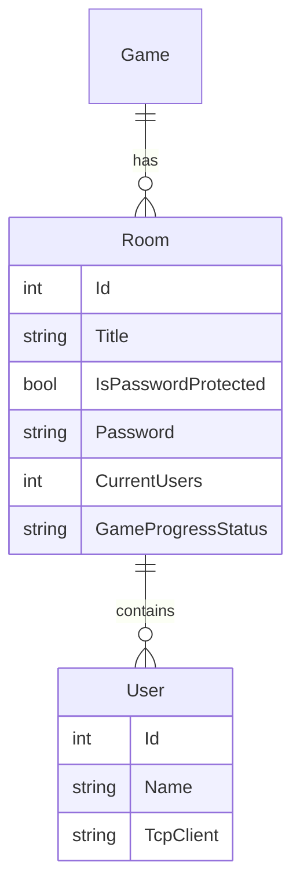

# 내부 구조

## 클래스 다이어그램

```mermaid
erDiagram
    Game{
    }
    
    User {
        int Id
        string Name
        string TcpClient
    }

    Room {
        int Id
        string Title
        bool IsPasswordProtected
        string Password
        int CurrentUsers
        string GameProgressStatus
    }
    Game ||--o{ Room : "has"
    Room ||--o{ User : "contains"
```